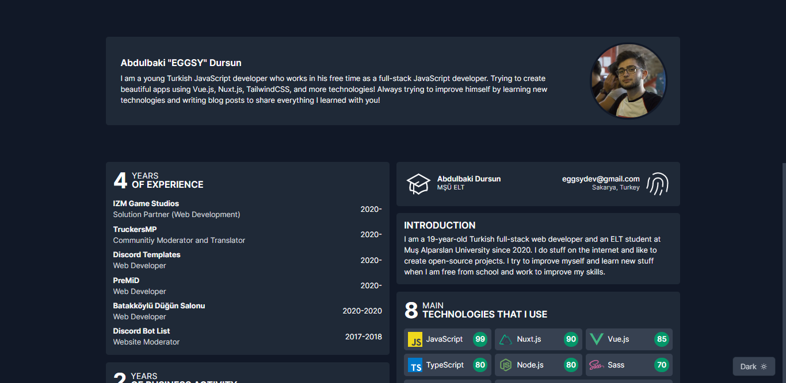
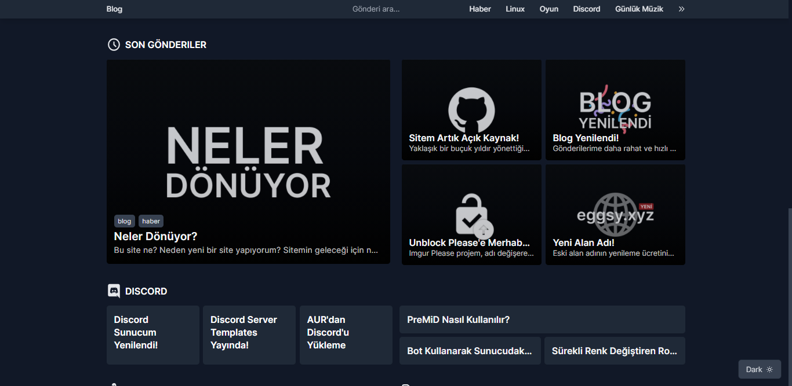
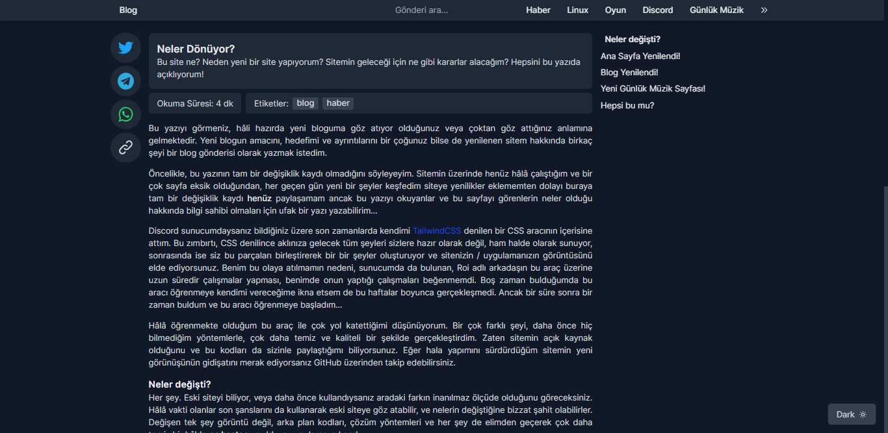
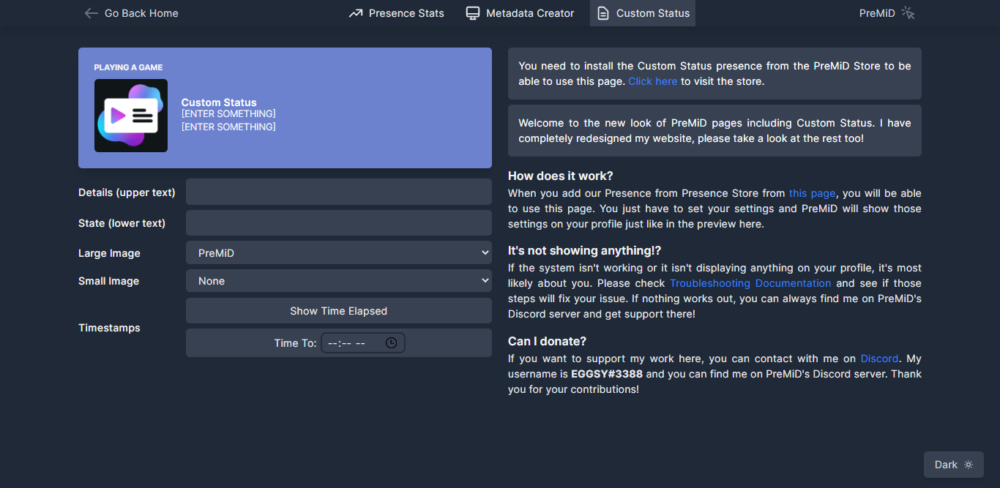
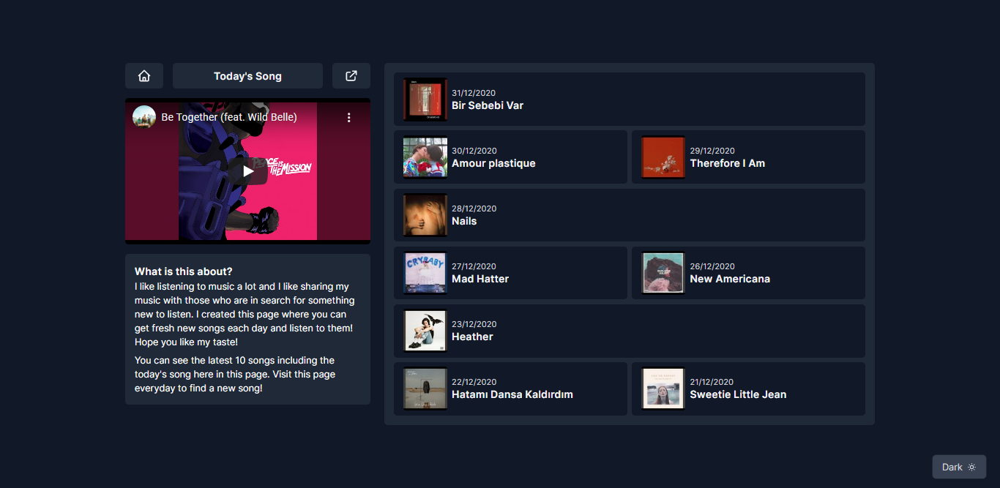

## EGGSY's Personal Website

> ⚠ Still work in progress... Will be merged with `master` branch when it is done. Until then, you can visit [this website](https://new.eggsy.xyz) to see it in action.

This website, also known as eggsy.codes or eggsy.xyz was first created in HTML, Bootstrap, and then it was moved to Vue.js and Vuetify. Though I liked and worked hard on the previous versions, my current knowledge and skills about web development is able to create something more unique and new. Here is the source code of my entire website, written in Nuxt.js and TailwindCSS!

This branch, will take place of old eggsy.xyz when I am done working on it. It is almost done, I am just taking my time to think more and more about the way I want my website to be. I will only list the updates and what have I done so far, there won't be installation steps until I am done with it. Then I will update this README file.

### What has changed so far?

Well, basically everything. My entire website is now being written in [Nuxt.js](https://nuxtjs.org) (static mode) and [TailwindCSS](https://tailwindcss.com). If you are not familiar with these two great things, check them out especially if you are looking for something to design your website. But I have to warn you that it is not easy as your favourite UI framework with many components and etc., like Vuetify or Bootstrap. You have to design everything yourself using the provided utility classes. When you get the hang of TailwindCSS, you will be able to create more and more beautiful websites everyday, and that's what I am doing right now.

### Updated homepage

I find the old design a bit "unresponsive" since the way I code includes many _fixed_ height and width settings, which lead my old homepage to look weird and "not nice" on larger screens. Now, with the new look, I wanted to design something "more about myself" and I created a page like a small portfolio about where I live, what I do and did in the past and my GitHub repositories including this one. It looks well until I get bored of this too 😅

  
  <a href="./demo/homepage.png">See it in light mode</a> - <a href="https://eggsy.xyz/?utm_source=github-tailwind-readme">See its old design</a>

### Updated blog

I have always felt my old blog was a bit "childish", simple rounded boxes and ugly UI in general. Now that I have learned TailwindCSS, I was able to create something that looks "more like a blog" and I am happy with the design so far. _Yes, it is still Turkish._

  
  <a href="./blog-homepage.png">See it in light mode</a> - <a href="https://eggsy.xyz/blog?utm_source=github-tailwind-readme">See its old design</a>

And the posts more feel like that you are reading a blog post now.

  
  <a href="./demo/blog-post.png">See it in light mode</a> - <a href="https://eggsy.xyz/blog/gonderi/site-artik-acik-kaynak?utm_source=github-tailwind-readme">See a post in old design</a>

### New look of PreMiD's Custom Status page!

This is the most _valuable_ page in my website. Ever since I created the [Custom Status presence](https://premid.app/store/presences/Custom%20Status) for PreMiD, this page started getting more and more hits. Now it's the page that gets most hits, and just like all pages, I redesigned it and cleaned the code, A LOT!

  
  <a href="./demo/homepage.png">See it in light mode</a> - <a href="https://eggsy.xyz/projects/premid/custom-status?utm_source=github-tailwind-readme">See its old design</a>

### And least but most important; Song Recommendations

You know how I feel about the music I listen to 😅 I look to share what I listen, and for almost 3 years, I have been sharing it my followers with my bot and old `eggsy.xyz`. Now, I think it deserves its own page.

  
  <a href="./demo/daily.png">See it in light mode</a>

Remember, this README file is like a changelog for now, I will include installation steps in the future but for now, it will stay like this. Hope you like the website as much as I do.  Remember to check all of those pages in [old website](https://eggsy.xyz) before you miss it!